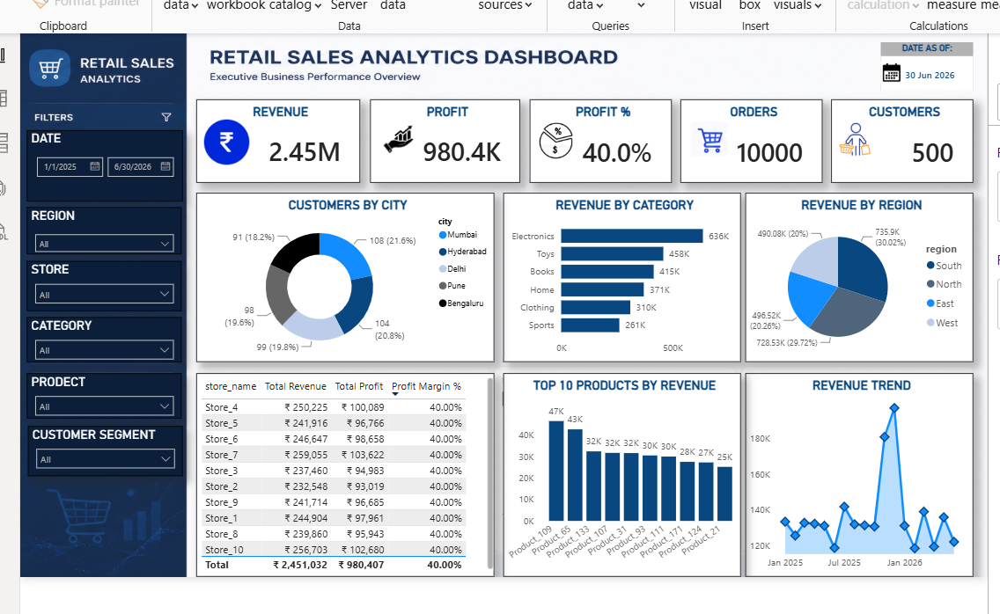
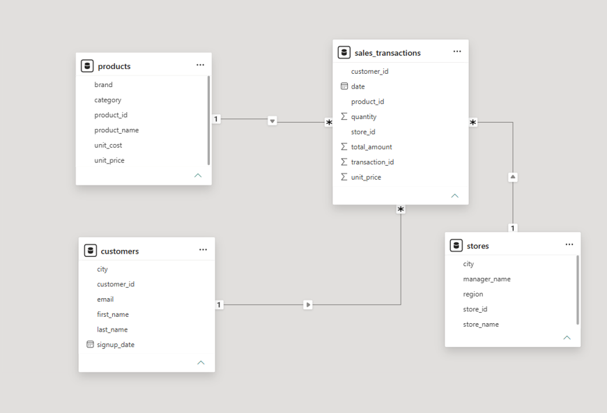
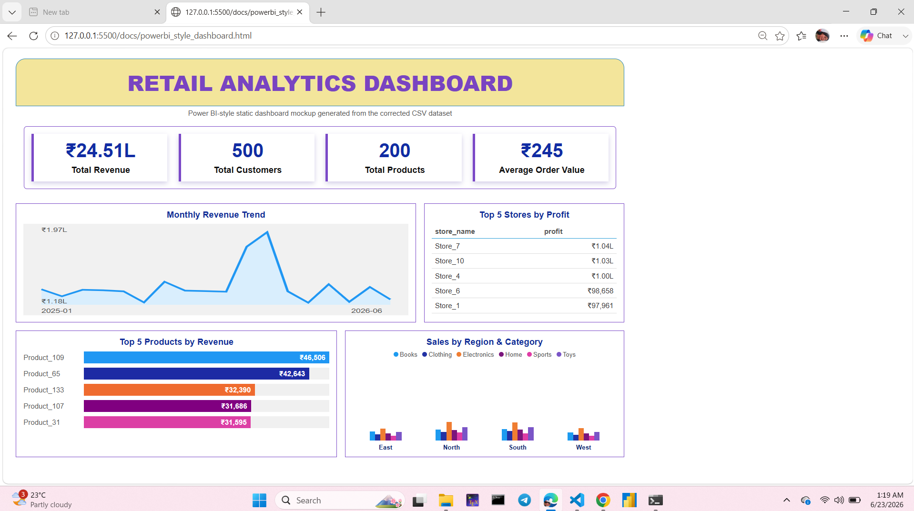

# Retail Intelligence Analytics Platform

## Project Overview

Retail businesses generate large volumes of sales, customer, product, and store data every day. However, raw data alone does not help decision-makers. The challenge is transforming transactional records into meaningful business insights.

This project demonstrates an end-to-end Retail Analytics solution built using SQL, Python, PostgreSQL, Power BI, Grafana, and Docker. The system generates retail sales data, stores it in a structured data warehouse, performs business analysis using SQL, and visualizes key performance indicators through interactive dashboards.

The project follows a complete analytics workflow:

Data Generation → Data Warehousing → SQL Analytics → Dashboard Reporting

---

## Business Problem

Management teams need answers to questions such as:

* Which regions generate the highest revenue?
* Which stores are most profitable?
* What products contribute the most sales?
* How does revenue change over time?
* Which customer segments drive business growth?
* What is the overall profit margin of the business?

This project provides a centralized analytical solution to answer these questions.

---

## Technology Stack

### Programming & Analytics

* Python
* SQL
* PostgreSQL
* Pandas
* SQLAlchemy

### Visualization

* Power BI
* Grafana

### Deployment

* Docker
* Docker Compose

### Development Tools

* VS Code
* Git
* GitHub

---

## Data Warehouse Design

The project uses a Star Schema architecture.

### Fact Table

#### sales_fact

Stores transactional sales information including:

* Transaction ID
* Customer ID
* Product ID
* Store ID
* Date ID
* Quantity Sold
* Revenue
* Profit

### Dimension Tables

#### dim_customer

Customer information and segmentation attributes.

#### dim_product

Product details including category, brand, cost, and selling price.

#### dim_store

Store location and regional information.

#### dim_date

Calendar information for trend analysis.

---

## Key Metrics

The dashboards provide the following KPIs:

* Total Revenue
* Total Profit
* Profit Margin %
* Total Orders
* Active Customers
* Average Order Value

---

## SQL Analysis Performed

The project includes analytical SQL queries covering:

### Revenue Analysis

* Monthly Revenue Trends
* Revenue by Region
* Revenue by Category
* Revenue by Store

### Product Analysis

* Top Selling Products
* Highest Revenue Products
* Product Category Performance

### Store Analysis

* Store Profitability
* Revenue Contribution by Store
* Store Performance Ranking

### Customer Analysis

* Customer Purchase Frequency
* Customer Lifetime Value
* RFM Customer Segmentation

### Business Performance Analysis

* KPI Tracking
* Revenue Growth Trends
* Profitability Analysis

---

## Dashboard Features

### Power BI Dashboard

Executive business dashboard featuring:

* KPI Cards
* Revenue Trend Analysis
* Revenue by Category
* Revenue by Region
* Top Products Analysis
* Store Profitability Analysis
* Customer Segmentation Insights



### 🎥 Demo Video
👉 Watch the dashboard demo here:  
https://drive.google.com/file/d/1cvI6ZroxMhbyZwFf3_O86nWXLEHCJiXY/view?usp=sharing
### Grafana Dashboard

Operational dashboard featuring:

* Real-time KPI Monitoring
* Revenue Trends
* Product Performance
* Store Performance
* Customer Insights
* Regional Analysis


---

## Project Structure

```bash
Retail-Intelligence-Analytics-Platform/
│
├── data/
├── docs/
├── etl/
├── grafana/
├── scripts/
├── sql/
│
├── docker-compose.yml
├── requirements.txt
├── README.md
└── LICENSE
```

---

## ER Diagram



## HTML Dashboard (Web Version)


---

## Project Workflow

### Step 1: Generate Data

```bash
python etl/generate_data.py
```

### Step 2: Start PostgreSQL and Grafana

```bash
docker compose up -d
```

### Step 3: Create Database Schema

```bash
docker compose exec -T postgres psql -U postgres -d retail_analytics -f /sql/schema.sql
```

### Step 4: Load Data

```bash
docker compose exec -T postgres psql -U postgres -d retail_analytics -f /sql/load_from_csv.sql
```

### Step 5: Open Grafana

```text
http://localhost:3000
```

---

## Project Outcomes

* Designed a retail data warehouse using a Star Schema.
* Built ETL pipelines using Python and PostgreSQL.
* Developed advanced SQL queries for business analysis.
* Created executive dashboards in Power BI.
* Developed monitoring dashboards in Grafana.
* Implemented Docker-based deployment for reproducibility.
* Generated actionable business insights from retail sales data.

---

## Skills Demonstrated

* Data Analytics
* SQL
* PostgreSQL
* Data Warehousing
* ETL Development
* Dashboard Development
* Business Intelligence
* Data Visualization
* Python Programming
* Docker

---

## Author

Anushka Yadav

B.Tech (Computer Science – AI & ML)

Aspiring Data Analyst | SQL | Power BI | Python | PostgreSQL | Grafana
